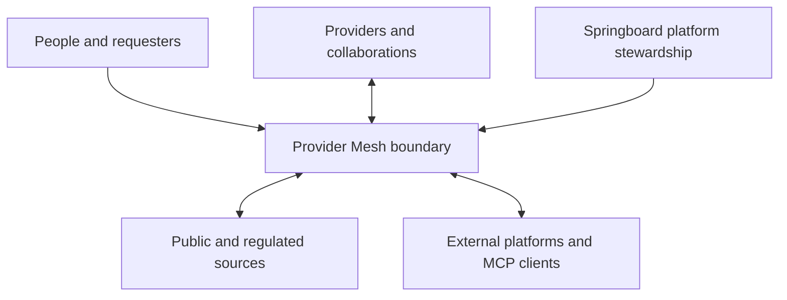
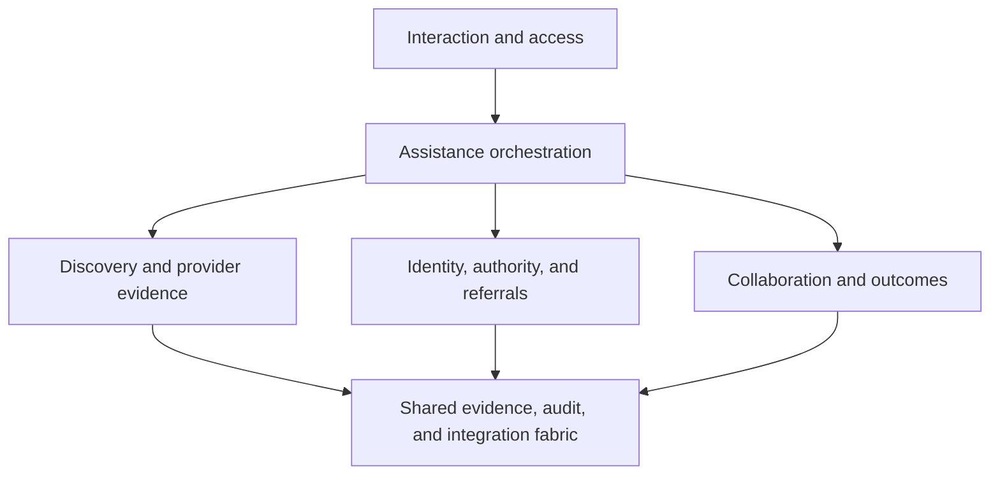
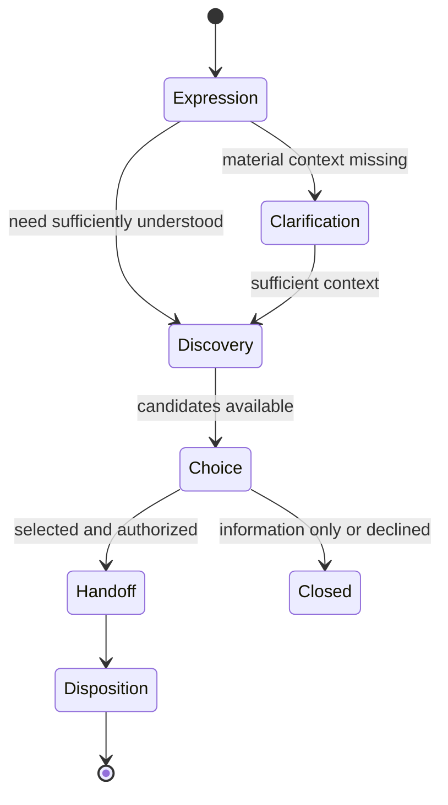

# Provider Mesh System Architecture

**Document ID:** PM-SA-001  
**Version:** 0.2  
**Status:** Approved — Controlling System Architecture — No Implementation Authority  
**Owner:** Springboard Delaware  
**Decision authority:** Judson Malone, Executive Director  
**Approved by:** Judson Malone, Executive Director  
**Approval date:** September 14, 2026  
**Scope:** Durable system structure, component responsibilities, trust boundaries, information flows, integration model, and architectural constraints  
**Canonical filename:** `SYSTEM_ARCHITECTURE.md`  
**Artifact identity:** Distinct non-canonical approved artifact  
**Canonical path required for operational effect:** `docs/SYSTEM_ARCHITECTURE.md`  
**Controlling product document:** Provider Mesh Product Constitution v1.1  
**Development governance:** Springboard Software Development Governance v0.2  
**Prior approved artifact SHA-256:** `8deb76ab714bdf89ce0029984d58107459882f9beed310a90a7f6fff93baad8d`  
**Amendment authority:** Judson Malone, September 14, 2026 — approved corrections from PM-REVIEW-002 v0.1 (F01, F05 architecture alignment, C02, and F04 cross-reference)  
**Approved amendment proposal SHA-256:** `f627f867f7fc184e468b4f36154297afe2496fb37d13b501442715e9ecef3adc`  
**Complete-artifact checksum and amendment record:** `PROVIDER_MESH_AMENDMENT_REGISTER_20260914.md` and `SHA256SUMS.txt`  

> **Operational-effect notice:** This is the distinct approved architecture artifact. It becomes operationally controlling when placed byte-for-byte at the canonical repository path and synchronized in accordance with Springboard Software Development Governance. Approval of this architecture does not authorize Class C implementation, production use, handling of real personal information, provider participation, external integration, or public release.

## 1. Purpose

This document translates the Provider Mesh Product Constitution into a durable system structure. It defines the major system responsibilities, the boundaries among them, the movement and custody of information, the role of artificial intelligence, and the means by which the Mesh can grow from low-integration human workflows into a more connected network.

This document establishes architecture, not detailed implementation. It does not select a hosting provider, programming language, database product, model provider, identity vendor, notification service, or deployment topology. Those choices require subordinate decisions and bounded implementation specifications.

## 2. Architectural thesis

Provider Mesh is a governed mediation and coordination platform situated between people seeking help, people assisting them, service providers, collaborations, and heterogeneous information systems.

It is not:

- a comprehensive provider directory;
- a replacement for provider case-management or clinical systems;
- a universal master record containing every fact about a person;
- an autonomous professional, eligibility, or crisis service;
- a single integration protocol imposed on every participant; or
- a system that can observe or guarantee every event occurring outside its boundary.

The architecture must remain useful when the only available pathway is public web information followed by a telephone call. It must also permit selected pathways to mature into structured APIs, secure portals, live availability connections, or Model Context Protocol connections without replacing the core product or weakening constitutional protections.

The resulting design is a **modular coordination core surrounded by a capability-based manifold of ports and adapters**. The core governs meaning, evidence, identity, authority, referrals, collaboration, and accountability. Adapters handle the particular mechanics of websites, APIs, databases, portals, communications systems, and MCP servers.

## 3. Architectural outcomes

The architecture must make the following outcomes possible:

1. A person or authorized requester can describe a need in natural language without first navigating a directory taxonomy.
2. The Mesh can determine whether and how the expression falls within its mission and ask only materially useful clarifying questions.
3. The Mesh can discover, compare, and explain relevant providers using current evidence from multiple sources.
4. Useful discovery does not depend on prior provider registration or permanent identification of the person.
5. A selected service option can become an authorized referral with a secure, accountable handoff.
6. A referral can remain a one-to-one relationship or deliberately transition into a charter-bound multi-provider collaboration.
7. A continuing person can be recognized across provider identifiers without making any external identifier universally canonical.
8. Provider systems remain their own systems of record while the Mesh retains only justified coordination, evidence, and accountability records.
9. Unknown, stale, conflicting, inferred, and unobserved facts remain visibly uncertain.
10. The system can learn from actual demand, attempted connections, barriers, and reported outcomes only under appropriate authority.
11. New technical connections can be added without redesigning the product around each source.
12. Human accountability remains identifiable at every consequential decision or representation.

## 4. Architecture principles

### 4.1 The core governs meaning; adapters govern mechanics

The Mesh core determines what a need, provider, evidence claim, identity association, authority grant, referral, collaboration, and outcome mean. An adapter determines how a specific source is queried or how a message is transported. Source-specific behavior must not redefine core business meaning.

### 4.2 Natural language is an interface, not the domain model

The Mesh accepts natural language but converts relevant parts of the conversation into explicit domain records and decision context. The original language remains available where authorized because structured extraction can omit nuance. Structured records do not replace source narratives.

### 4.3 AI proposes; governed services authorize and record

AI may interpret, retrieve, compare, summarize, and propose next actions. Deterministic application services and accountable human authority govern identity association, information disclosure, referral transmission, provider acceptance, permissions, and confirmed outcomes.

### 4.4 Evidence is retained separately from conclusions

A provider profile, recommendation, identity match, referral status, or outcome is a projection assembled from evidence. Source observations and consequential claims retain source, time, method, authority, confidence, conflict, and supersession information. A new conclusion must not erase the evidence from which an earlier conclusion was formed.

### 4.5 Standards define exchange surfaces, not the whole product

Provider and service information should use an Open Referral HSDS-compatible representation. Health, homeless-services, education, and other domain standards may define import, export, or projection formats. No external schema is presumed to cover the complete Mesh domain or to determine the physical storage model.

### 4.6 MCP is an interoperability boundary, not the internal architecture

MCP may expose or consume resources and tools at authorized boundaries. It does not replace domain objects, internal application interfaces, durable workflows, authorization, evidence controls, or the source-specific adapters needed to reach heterogeneous systems.

### 4.7 A provider is independent of every connection

A provider remains a real service-capable person or organization. A website, directory record, API endpoint, database row, phone number, portal, or MCP server is evidence about or a connection to that provider—not the provider itself.

### 4.8 Persistence follows purpose

The Mesh stores durable information only when needed for identity continuity, authorized service coordination, evidence integrity, accountability, operational duties, or separately approved learning. Search results and transient conversational content are not automatically permanent records.

### 4.9 Capability must degrade gracefully

A failed source, missing API, unavailable provider portal, or absent MCP server must not disable all discovery. The system must fall back to other appropriate sources or a human pathway while stating the resulting limitations.

### 4.10 Consequence determines assurance

Low-consequence public discovery can proceed with little or no identity information. Identity proof, human review, authorization, and evidence requirements increase as an action becomes more consequential.

## 5. System context and trust boundaries

### 5.1 External actors

| Actor | Relationship to the Mesh | Authority boundary |
|---|---|---|
| Person with a need | Intended beneficiary; may make requests and control voluntary choices | Authority over personal goals and permitted use, subject to applicable law and legitimate limitations |
| Requester or supporter | Acts for self or assists another person | Must establish authority appropriate to the requested information and action |
| Navigator or caseworker | Provides human assistance and context | Professional or organizational role does not confer blanket access |
| Provider | Considers referrals and may deliver services | Retains eligibility, acceptance, professional, service, and internal-record authority |
| Provider point of contact | Receives or responds to a referral for a provider | Authority is bounded to the provider, service, role, and communication purpose |
| Collaboration participant | Coordinates under a shared agenda | Authority exists only within the collaboration charter and applicable person permissions |
| Collaboration lead or backbone agency | Sustains a particular collaboration | Does not acquire general platform authority or control of unrelated collaborations |
| Springboard platform steward | Operates and governs the shared platform | Accountable for Mesh operations, representations, access, corrections, and platform incidents |
| Springboard service program | May itself act as a provider | Must remain logically and operationally distinct from platform stewardship |
| Automated requester or MCP client | Requests authorized information or action | Technical access never substitutes for actor identity, purpose, permission, or consequence checks |
| External source | Supplies public, licensed, regulated, or participant-contributed information | Its authority is claim-specific and its content is not trusted universally |

### 5.2 Primary trust boundaries

1. **Public-to-Mesh boundary:** Unauthenticated or lightly authenticated requests enter a mission-bounded environment. Public discovery must not expose nonpublic personal or provider information.
2. **Authenticated participant boundary:** Known people, supporters, providers, and staff gain capabilities based on identity, role, relationship, purpose, and authority—not membership alone.
3. **Organization boundary:** Each provider and collaboration retains a distinct institutional boundary even when using shared Mesh capabilities.
4. **Springboard role boundary:** Platform stewardship, backbone work, and Springboard service delivery remain separately authorized roles.
5. **External-source boundary:** Content and tool descriptions from websites, APIs, directories, and MCP servers are untrusted until evaluated under source and evidence rules.
6. **Model boundary:** Information sent to an AI model is minimized and restricted according to sensitivity, contractual protection, approved purpose, and model-use policy.
7. **Secondary-use boundary:** Operational service information does not flow into research, population analysis, or model-development environments without separately approved authority and controls.
8. **Notification boundary:** Email, SMS, and similar services carry minimal notification content and secure pointers, not referral documents or unnecessary confidential details.

## 6. Logical architecture

The initial system should be implemented as a **modular monolith with explicit bounded modules**, durable records, and ports-and-adapters integration. This provides transactional integrity and manageable operations while preserving seams for later decomposition. A move to separately deployed services requires evidence of scale, isolation, resilience, or organizational need and an approved architecture decision record.

The diagram identifies logical responsibilities, not required deployable services.

### 6.1 Interaction and Access Gateway

Responsibilities:

- accept public, authenticated, provider, staff, API, and MCP requests;
- establish the requester channel and claimed role;
- maintain accessible conversation and structured interaction state;
- enforce authentication and session controls appropriate to the requested action;
- disclose whether the person is interacting with AI and when human support is available;
- render candidate choices, uncertainty, permissions, and consequential confirmations clearly; and
- separate public discovery from authenticated personal or organizational workspaces.

The gateway may support chat, guided forms, navigator interfaces, provider workspaces, conventional APIs, and MCP. Every channel invokes the same domain policies.

### 6.2 Assistance Orchestrator

Responsibilities:

- interpret the person's expression in context;
- determine mission relevance without relying on keywords alone;
- identify one or more possible needs while preserving the person's stated priorities;
- decide whether missing context could materially change the offered help;
- ask bounded clarifying questions;
- invoke discovery after the need is sufficiently understood;
- present explainable choices rather than silently selecting a provider;
- collect referral-specific information only after a person selects or authorizes a pathway;
- identify urgent safety indicators and direct the requester to the appropriate human authority or specialized service; and
- stop the AI interaction from becoming indefinite counseling, intake, or professional consultation.

The orchestrator maintains an explicit interaction state rather than depending on unconstrained model conversation.

Urgent safety routing may interrupt any state. It does not create a general Springboard crisis-response duty.

### 6.3 Model Gateway

All AI-model processing within the Mesh application and its operational data workflows passes through the governed Model Gateway. External drafting, coding, and synthetic evaluation tools operate only under their separately approved development authority and data restrictions; they may precede the production gateway and do not authorize a bypass for Mesh operational data.

Responsibilities:

- select an approved model and processing mode for the task and data classification;
- minimize or redact information before model use;
- separate public/synthetic processing from authorized confidential processing;
- apply bounded system instructions and task schemas;
- record model, version, instruction set, time, input classification, and output provenance needed for accountability;
- require structured output validation before domain mutation;
- prevent model output from directly granting authority, merging identity, transmitting a referral, or confirming an outcome;
- support human review and correction of AI-derived material; and
- prohibit use of identifiable or confidential Mesh information for training a general-purpose or third-party model.

The exact model providers, deployment arrangements, retention terms, regulated-data eligibility, and contractual protections require approval in the Security and Audit document and applicable ADRs.

### 6.4 Discovery Service

Responsibilities:

- convert the understood need into a source-neutral discovery request;
- translate the person's language across SDOH, provider, directory, and source-specific vocabularies without discarding the original expression;
- represent location, service area, travel mode, accessibility, remote-service options, and time constraints needed to interpret terms such as "near me";
- identify which source capabilities are relevant;
- query multiple available sources through the Integration Manifold;
- normalize and deduplicate provider, service, and location candidates and, when workforce or learning capabilities are adopted, Organization and Opportunity candidates with their offering capacities preserved;
- extract claim-level evidence, including access requirements and referral pathways;
- assess relevance using the person's stated priorities and material constraints;
- preserve conflicts, gaps, and time sensitivity;
- produce an explainable candidate set; and
- record only the discovery evidence and activity justified by the interaction.

Discovery operates on the need of a particular person or requester. It must not become a general background crawl intended to reconstruct the whole service ecosystem.

#### Taxonomy translation

Taxonomies are versioned translation resources inside discovery, not the outer boundary of permissible assistance. A translation record should retain the original expression, proposed need concepts, source taxonomy terms, mapping method, confidence, version, and human correction. A taxonomy match does not establish diagnosis, eligibility, urgency, or provider suitability by itself.

Geographic matching likewise distinguishes straight-line proximity from practical access. Candidate evaluation may consider jurisdiction, service area, transportation, remote access, accessibility, hours, and the person's stated ability to travel. Precise person location is retained only when justified by the requested action.

### 6.5 Provider and Service Registry

The registry provides continuity of provider identity and an HSDS-compatible projection of available provider and service information. When workforce or learning capabilities are adopted, the same registry responsibility supports the Organization, Organization Capacity, and Opportunity anchors defined in Domain Model sections 5, 8, and 11. An employer or learning offering does not acquire Provider status or become an HSDS Service merely by being discovered or connected. This extends the existing logical responsibility without creating a separate deployable service.

Its primary functions are:

- assign an internal Mesh Provider ID to a distinct provider entity;
- recognize when newly discovered evidence concerns a previously encountered provider;
- distinguish organization, program, service, location, and service-at-location;
- associate aliases, websites, public identifiers, addresses, phone numbers, and parent-child relationships used for identity resolution;
- retain source pointers and participation status;
- support an HSDS-compatible provider/service exchange view; and
- record interactions with a provider without converting historical activity into current service facts.

The registry is intentionally sparse when evidence is sparse. A record may begin with only enough information to recognize and find the provider again. A discovery event may enrich available HSDS fields as a byproduct, but enrichment does not create an obligation to maintain every field continually.

#### Provider encounter and participation dimensions

Provider encounter history and Provider Participation are independent. Encounter events record first observation, re-observation, discovery use, contact, or other interaction. Participation records the applicable agreement and its scope, with states of no participation agreement, pending, active, suspended, withdrawn, expired, or terminated, as defined by Domain Model sections 8.4–8.5. An encounter never activates, renews, suspends, or terminates participation. Identity resolution and correction remain a third independent dimension.

Participation affects authority and contribution responsibility, not the provider's underlying identity or eligibility for fair discovery.

#### HSDS relationship

The registry adopts a version-pinned **HSDS-compatible canonical projection** centered on:

- `organization`;
- `service`;
- `location`; and
- `service_at_location`.

Related HSDS concepts may represent programs, contacts, phones, schedules, funding, service areas, required documents, languages, accessibility, cost options, organization identifiers, taxonomies, attributes, and metadata.

HSDS is an exchange specification designed to complement, not replace, local storage. The physical Mesh model may therefore add internal identity anchors, source observations, claim evidence, participation, confidence, conflicts, and activity records not supplied by HSDS. External HSDS identifiers must be namespaced to their publisher; they are not automatically Mesh identity keys.

### 6.6 Evidence and Claim Ledger

The evidence ledger is the source of accountability for consequential representations.

A claim record should be capable of representing:

- subject and claim type;
- asserted value;
- source identity and source location;
- observation, publication, effective, and expiration times when known;
- acquisition method and adapter;
- contributor or accountable institution;
- whether the value is observed, reported, inferred, conflicting, stale, or unconfirmed;
- confidence or assurance supported by defined criteria;
- authority and permitted-use context;
- relationship to supporting artifacts;
- supersession, correction, dispute, or withdrawal state; and
- the projection or recommendation in which the claim was used.

The ledger should be append-oriented. Corrections normally supersede or annotate earlier claims rather than silently rewriting history. Current provider views, discovery results, identity decisions, and outcome summaries are projections from the ledger and other authoritative domain records.

### 6.7 Integration Manifold

The Integration Manifold is the capability-based collection of source and action adapters through which the core interacts with the outside world.

Each registered port describes:

- the external source or endpoint;
- provider or owner of the connection;
- available capabilities;
- supported request and response contracts;
- authentication and authorization requirements;
- data classification permitted through the port;
- rate, cost, licensing, and use restrictions;
- expected currency and availability characteristics;
- source authority by claim type;
- error and fallback behavior;
- version and health status; and
- the accountable maintainer.

Capabilities are explicit and must not be inferred merely from the connection type. Representative capabilities include:

- search public information;
- retrieve a provider or service record;
- query availability;
- identify referral requirements;
- transmit a referral;
- confirm delivery or acknowledgement;
- receive a provider-reported disposition;
- reserve a resource; and
- expose authorized Mesh resources or actions.

#### Port types

| Port type | Typical use | Architectural treatment |
|---|---|---|
| Public web | Provider pages, public documents, government lists | Retrieval, extraction, source capture, and time-bounded evidence |
| Search or place API | Candidate discovery and geographic verification | Licensed API adapter; result is evidence, not authority for all claims |
| Directory API | Findhelp, 211, or similar community-resource data | Normalize to HSDS-compatible projection; retain publisher provenance |
| Regulatory source | Legal identity, licenses, certifications | Claim-specific authority; effective-date and jurisdiction controls |
| Provider portal | Human or automated provider intake | Secure pointer handoff; no automated form completion unless separately authorized |
| Live network API | Availability, eligibility inquiry, reservation | Transactional contract, idempotency, explicit acceptance, and reconciliation |
| Human communication | Telephone, secure message, or email notification | Baseline operating port; externally occurring details remain unknown unless reported |
| Database connection | Approved direct or replicated data access | Least privilege, schema isolation, source-system authority, and change controls |
| MCP server | Resources and tools exposed by an authorized external system | Capability negotiation plus Mesh authorization, evidence, and tool-safety controls |
| Mesh MCP server | Authorized Mesh resources and actions exposed to external agents | Purpose-bound scopes, actor attribution, consent, rate controls, and audit |

Every adapter returns a canonical result envelope containing data, provenance, timestamps, limitations, and error state. A transport success is not equivalent to a true claim, referral acceptance, or service outcome.

### 6.8 MCP Gateway

The MCP Gateway is a boundary component of the Integration Manifold.

Provider Mesh may act in two roles:

1. **MCP host/client:** The Mesh connects to registered MCP servers to obtain resources or invoke authorized tools.
2. **MCP server:** The Mesh exposes selected resources, prompts, and tools to authorized external hosts or agents.

Architectural rules:

- MCP connections are registered and capability-scoped.
- The external organization or provider remains a domain entity distinct from its MCP endpoint.
- MCP resource content is evidence with source and time information.
- Tool descriptions and annotations are treated as untrusted connection metadata until validated.
- A tool call cannot bypass Mesh permission, consequence, confirmation, or audit controls.
- Human consent and institutional authorization are enforced by the Mesh; MCP does not supply them automatically.
- Requests carry actor, purpose, organization, correlation, and authority context where applicable.
- Consequential actions use idempotency, durable status, and reconciliation.
- Protocol and extension versions are pinned per adapter and upgraded through an ADR or authorized maintenance process.
- Wrapping discovered web information as an internal MCP resource improves reuse but does not increase the information's authority or currency.

The internal application must not use MCP as its sole module-to-module protocol. Domain services use typed application contracts and durable events; MCP remains an external interoperability option.

### 6.9 Person Continuity and Identity Service

The identity service establishes durable but contestable person continuity without requiring identity for ordinary public discovery.

It distinguishes:

- **Session:** A technical interaction context. A browser cookie may support a session, but it is not a person or episode identifier.
- **Assistance episode:** A bounded sequence of interactions concerning one or more expressed needs. It may remain anonymous or pseudonymous.
- **Mesh Person ID:** A non-semantic internal identifier representing an asserted continuing relationship with a person.
- **External identity link:** A namespaced association between a Mesh Person ID and an identifier assigned by HMIS, health care, education, benefits, justice, or another system.
- **Identity evidence:** Information used to propose or validate sameness, retained with source, time, assurance, and dispute status.
- **Contact method:** A time-bounded means of reaching the person; it is not the person's identity.

#### Identity lifecycle

1. Public discovery begins without a Mesh Person ID when continuity is unnecessary.
2. An assistance episode is created when interaction continuity, referral preparation, or accountability requires a durable transaction context.
3. A Mesh Person ID is created or linked when a requested service, continuing relationship, or authorized coordination requires person continuity.
4. Reported first name, last name, and date of birth may create a provisional asserted identity and candidate search. They do not authorize automatic merging.
5. Additional evidence is sought in proportion to the consequence of the association or disclosure.
6. A candidate match becomes a confirmed association only through an approved assurance process.
7. Corrections, de-linking, and reversible merge history preserve a route to remedy.

The identity service must support people without stable phones, email addresses, devices, or conventional documents. Authentication and account recovery may use multiple approved pathways, including recovery credentials, trusted delegated relationships, and in-person or provider-assisted proofing. The exact assurance policy belongs in the Identity and Access specification.

The Mesh Person model may support domain-standard projections, including HMIS Universal Data Elements and health-system identity links. HL7 FHIR `Person` is a useful interoperability reference because it represents cross-system linkage and link assurance, but it is not adopted as the complete Mesh person schema. Domain records remain separate from the cross-domain continuity record.

### 6.10 Relationship, Authority, and Access Service

This service determines whether an actor may view information or perform an action.

An authority record must be capable of expressing:

- actor identity and represented organization;
- relationship to the person or collaboration;
- authority type and legal or voluntary basis;
- permitted purpose;
- information scope;
- action scope;
- effective time and expiration;
- conditions or obligations;
- source and evidence;
- revocation, dispute, or supersession; and
- the accountable issuer or reviewer.

Access decisions use attributes of the actor, organization, relationship, purpose, information, action, environment, and consequence. They are deny-by-default when required authority is absent or materially ambiguous.

The service must distinguish guardianship, fiduciary authority, legal representation, custodial responsibility, compulsory relationships, professional duties, provider participation, navigation, and voluntary delegation. These are not interchangeable roles.

Authentication establishes who is operating an account. Authorization establishes what that actor may do in a particular context. Identity association and authorization remain separate decisions.

### 6.11 Referral Service

A referral is represented as a durable domain record, not only as a static document.

The referral record includes:

- Referral ID and version history;
- person and requester context appropriate to the authorized purpose;
- selected provider, service, location, and receiving point of contact;
- relevant need and desired service connection;
- authority and consent basis;
- referral script versions;
- secure document references;
- transport attempts and delivery evidence;
- provider acknowledgements or reported responses;
- procedural disposition;
- follow-up responsibility accepted by each party;
- reported outcome claims; and
- audit history.

#### Referral envelope and script

The **referral envelope** is the secure control record that binds participants, authority, purpose, state, document references, transport events, and custody information.

The **referral script** is a human-readable and machine-extractable account of the need, requested connection, and relevant information at a specific version. The script is a document within the referral record; it is not the entire record.

Documents such as identification, notices, letters, photographs, and case notes are stored in a secure document repository. The envelope stores governed references to those objects rather than embedding duplicate files. Each reference carries purpose, access, custody, integrity, and retention metadata.

Email or SMS may notify an authorized recipient that a referral is available, but confidential referral content is accessed inside the secure environment unless a separately approved integration transmits it under equivalent controls.

#### Referral state and evidence

The state model must preserve distinctions among:

- prepared;
- authorized;
- transmission attempted;
- delivered;
- acknowledged;
- accepted or declined by the provider;
- no response observed;
- withdrawn;
- procedurally closed; and
- reported service or need outcomes.

These labels require defined evidence. Procedural closure never means the need was satisfied.

#### Progressive transport

The referral service supports increasing levels of integration:

1. **Human baseline:** The Mesh identifies a receiving contact, notifies or assists the requester to call, and provides authorized access to the secure referral script.
2. **Provider workspace:** A participating provider receives and acknowledges referrals in the Mesh while continuing to manage accepted clients in its native system.
3. **Portal or API handoff:** A designated adapter transmits allowed information or deep-links to the provider's intake system. The Mesh does not prefill or submit external applications without separate authorization and a defined transaction contract.
4. **Transactional network integration:** An approved API may query availability, submit a referral, or reserve a resource with explicit idempotency, acceptance, expiration, and reconciliation rules.
5. **MCP tool integration:** An authorized MCP tool may expose equivalent capabilities subject to the same domain controls; protocol availability does not lower the proof required for the action.

Replies occurring by telephone, ordinary email, or a provider's internal system remain unknown unless an authorized person or system reports them. The Mesh does not fabricate closed-loop status from transmission alone.

### 6.12 Secure Document Service

The Secure Document Service stores and governs referral and collaboration artifacts.

It must support:

- encrypted object storage;
- opaque object identifiers and secure references;
- cryptographic integrity digest;
- versioning and immutable receipt copies where required;
- malware and content-safety scanning;
- document classification and purpose;
- contributor, custodian, and receiving-party records;
- fine-grained access and time limits;
- access logging;
- retention, legal hold, correction, and disposition controls; and
- safe preview and download behavior.

Database records contain document metadata and pointers. Binary content resides in the protected object store. Search or AI extraction operates through controlled processing and does not create an unrestricted duplicate corpus.

### 6.13 Collaboration Service

The Collaboration Service supports many-to-many work only within a defined collaboration context.

A collaboration record includes:

- Collaboration ID;
- common agenda and population or problem focus;
- participating organizations and authorized representatives;
- lead and backbone roles;
- commitments and decision rights;
- shared understanding of progress and defined measures;
- communication and meeting practices;
- person-participation and information-authority rules;
- conflict, correction, and escalation process;
- effective dates, versions, approvals, suspension, and closure; and
- boundaries with other collaborations.

Each collaboration is a separate authorization and information compartment. Overlapping participants do not create automatic information flow between collaborations.

#### Case review

An authorized person-specific case review may provide:

- secure group and one-to-one communication;
- meeting and attendance records;
- source notes or uploaded documents;
- AI-assisted transcription or summaries where authorized;
- goal-focused narrative accounts;
- structured need, barrier, action, owner, due-date, and reported-status extraction;
- participant corrections and disagreement;
- provider-owned action items; and
- longitudinal views of reported progress.

AI-derived summaries remain labeled and linked to their source interaction. They do not become professional findings or confirmed outcomes merely because they are structured.

Providers execute assigned work in their own systems. The Mesh records the coordination account and reported status, not a false replica of every provider case record.

#### Referral-to-collaboration transition

A one-to-one referral does not automatically become a collaboration. Transition requires:

1. an identified reason for multi-party coordination;
2. defined additional participants;
3. appropriate person and organizational authority;
4. an existing or newly established collaboration charter;
5. explicit information boundaries; and
6. a recorded transition event.

Referral information enters the collaboration only through an authorized contribution. Provider receipt of a referral does not automatically expose that referral to other collaboration participants.

### 6.14 Outcome and Procedural Disposition Service

The Mesh records outcomes as evidence-based claims rather than as a single global status.

The service distinguishes:

- information supplied;
- connection attempted;
- contact established;
- referral transmitted;
- referral acknowledged;
- provider acceptance or decline;
- enrollment or service start;
- service received;
- barrier or unmet need;
- person-reported experience;
- provider-reported result;
- coordination activity;
- individual change; and
- population-level change.

Every claim identifies the reporter or source, observation time, applicable person or cohort, confidence, dispute state, and relationship to the original need. An out-of-Mesh event is not known merely because it was expected.

### 6.15 Human Review and Platform Operations

The architecture provides accountable work queues for matters within Springboard's platform authority, including:

- identity association and de-linking disputes;
- access, authority, and permission conflicts;
- correction requests;
- complaints about Mesh-generated representations;
- provider identity or representation disputes;
- suspected misuse;
- account recovery and platform access problems;
- privacy and security incidents attributable to the Mesh; and
- material conflicts among controlling obligations.

Queues identify the accountable role, consequence, urgency, service commitment, status, evidence, and disposition. They must not imply continuous live Springboard navigation, clinical, legal, case-management, or crisis services unless such a service has been separately authorized and resourced.

### 6.16 Analytics and Learning Boundary

Operational transaction records may support authorized learning, but analytics is a separate architectural boundary.

The boundary must:

- begin from an approved use and defined public or client benefit;
- separate identifiable operational data from approved analytic datasets;
- minimize fields and time ranges;
- apply aggregation, de-identification, access, and disclosure controls proportionate to re-identification risk;
- retain data lineage and transformation records;
- distinguish demand, attempted access, successful connection, provider response, reported individual outcome, and population change;
- represent participation and reporting gaps;
- prevent operational access from silently becoming research or model-training access; and
- support deletion, correction, retention, and oversight obligations applicable to the authorized use.

No identifiable longitudinal research environment is authorized by this architecture alone. It requires the Board-approved policy, legal and privacy review, and specific authorization required by the Constitution.

### 6.17 Audit Service

The Audit Service provides tamper-evident records of consequential platform activity, including:

- authentication and account events;
- authority grants, denials, changes, and revocations;
- access to nonpublic information;
- identity links, merges, disputes, corrections, and de-links;
- evidence acquisition and material transformations;
- AI-generated consequential representations and human corrections;
- referral authorization, access, transmission, receipt, and disposition;
- collaboration membership, charter, and information-boundary changes;
- document access and custody events;
- external tool invocations and transactional results;
- platform-admin actions; and
- research or export operations.

Audit records identify the actor, represented organization and role, purpose, action, target, time, correlation, result, and applicable policy decision. Audit access is itself audited.

## 7. Data architecture

### 7.1 Durable record families

| Record family | Purpose | Default character |
|---|---|---|
| Interaction and episode | Maintain bounded conversational and transaction continuity | May be anonymous or pseudonymous |
| Need and constraint | Represent the person's expressed priority and material matching context | Purpose-limited and time-aware |
| Provider and service | Recognize provider identity and produce HSDS-compatible views | Sparse, evidence-backed, refreshed when used |
| Evidence claim | Preserve source, time, authority, uncertainty, conflict, and correction | Append-oriented |
| Person continuity | Maintain Mesh Person ID and identity evidence | Durable, contestable, minimal |
| External identifier link | Associate namespaced provider-system identifiers | Assurance-rated and reversible |
| Contact method | Support communication without treating contact as identity | Effective-dated and replaceable |
| Relationship and authority | Establish bounded permission and represented role | Purpose-, action-, information-, and time-scoped |
| Referral | Govern a bounded provider handoff | Durable state and event history |
| Secure document | Retain protected content and custody metadata | Stored by reference with independent controls |
| Collaboration | Govern shared agenda, membership, authority, and measures | Charter-versioned and compartmented |
| Narrative and structured note | Preserve human context and derived structure | Source-linked, attributable, correctable |
| Outcome claim | Report what occurred without overclaiming | Source- and time-specific |
| Audit | Establish accountability for consequential activity | Tamper-evident and access-controlled |
| Analytic dataset | Support a separately authorized learning purpose | Derived, minimized, isolated, and governed |

### 7.2 System-of-record boundaries

Provider Mesh is authoritative for:

- Mesh-assigned identifiers;
- Mesh access and authority records;
- the Mesh account of discovery actions and evidence used;
- Mesh-created referral envelopes, script versions, transmission events, and procedural dispositions;
- Mesh collaboration charters, membership, and coordination records;
- Mesh audit events; and
- corrections and disputes concerning Mesh-generated representations.

Provider systems remain authoritative for:

- provider eligibility and professional decisions;
- provider acceptance when made in the provider's system or by an accountable provider representative;
- services delivered and provider-created case, clinical, education, or program records;
- provider internal identifiers; and
- information the provider contributes under its own asserted authority.

External publishers remain the source for their published records. The Mesh is authoritative only for what it observed, when it observed it, how it interpreted it, and what it did with that evidence.

The person retains constitutional rights and control over voluntary choices and authorized sharing. The architecture does not reduce those rights to a simplistic claim that one party exclusively owns all copies of information.

### 7.3 Projection model

The system separates source records from operational projections:

1. Source observations and contributed records are retained with provenance.
2. Normalization maps them into shared domain concepts.
3. Identity resolution proposes or establishes entity associations with assurance.
4. Current projections assemble usable provider, person, referral, or collaboration views.
5. Recommendations and summaries identify the projection version and material evidence used.

Derived projections should be rebuildable from authoritative domain records and evidence. A search index or model embedding is a derived retrieval aid, not an authoritative record.

### 7.4 Storage roles

The logical architecture requires:

- a transactional relational store for domain state and constraints;
- protected object storage for documents;
- a search or retrieval index for provider, service, evidence, and authorized narrative discovery;
- an append-oriented audit store with tamper-evidence;
- a job and event mechanism for durable external work; and
- an isolated analytic environment for separately authorized secondary use.

These are logical roles and may initially share managed infrastructure where isolation, access control, recovery, and performance requirements are satisfied. Product selection requires an ADR.

## 8. Core information flows

### 8.1 Discovery flow

1. Receive a natural-language expression or structured request.
2. Establish requester context and the consequence of the requested action.
3. Determine mission relevance and possible needs.
4. Ask only questions whose answers materially affect discovery or handoff.
5. Create a source-neutral discovery request containing location, access, urgency, preferences, and constraints needed for matching.
6. Select suitable Integration Manifold ports.
7. Retrieve current candidate information and source evidence.
8. Normalize and resolve providers, services, and locations.
9. Reconcile claims and preserve conflicts or gaps.
10. Rank or filter candidates using explainable need-fit criteria.
11. Present choices with material requirements, limitations, sources, and freshness.
12. Record the justified discovery transaction and minimal provider identity anchors.

### 8.2 Referral flow

1. The person or authorized requester selects a provider or asks the Mesh to assist with connection.
2. The Mesh discovers the provider's published referral route, requirements, and documentation needs.
3. The Mesh establishes identity and authority only to the degree required for the referral.
4. The requester reviews and authorizes the referral purpose, receiving provider, script, and documents.
5. The Mesh creates a versioned referral envelope and secure references.
6. The selected transport adapter performs the handoff or supports human contact.
7. Delivery, acknowledgement, response, and follow-up events are recorded only when evidenced.
8. The referral reaches a procedural disposition without implying service success.

### 8.3 Identity-link flow

1. A request requiring continuity identifies or creates an assistance episode.
2. The person or authorized worker supplies available identifying information.
3. The Mesh searches for candidate persons using normalized, privacy-protected matching.
4. The service presents candidate evidence or requests additional validation proportionate to consequence.
5. An approved actor confirms a new Mesh Person ID or an association to an existing one.
6. External identifiers are stored as namespaced links with assurance, source, and time.
7. Subsequent disputes can suspend, correct, or de-link an association without erasing audit history.

### 8.4 Collaboration flow

1. Participating organizations approve or join a collaboration charter.
2. A person's participation and information scope are established under appropriate authority.
3. Authorized participants communicate or meet within the collaboration compartment.
4. Original human accounts, AI-derived summaries, structured goals, and action items remain distinguishable.
5. Each provider performs its work in its native system and reports only authorized coordination status.
6. Progress and barriers are reviewed against the shared agenda without converting reported activity into unverified outcomes.
7. Membership, authority, charter versions, and closure are recorded over time.

### 8.5 Live availability or reservation flow

1. Discovery identifies an integrated service with a live capability.
2. The adapter declares whether it can query, hold, reserve, refer, or only display information.
3. The Mesh authenticates the actor and verifies purpose and authority.
4. A query returns availability with source time, scope, and expiration.
5. A reservation or hold requires explicit user confirmation and an idempotent transaction key.
6. The external system returns an authoritative transaction identifier and status.
7. The Mesh records the result and reconciles timeouts or ambiguous responses.
8. The provider or network remains authoritative for the resource and acceptance.

## 9. Provider discovery and evidence rules

### 9.1 Claim-specific source authority

The Discovery Service evaluates authority by claim. Examples include:

| Claim | Usually stronger evidence |
|---|---|
| Legal organization identity | Government or recognized registration source |
| License or certification | Applicable licensing authority |
| Provider-controlled program description | Current official provider publication |
| General service classification | HSDS publisher, 211, Findhelp, provider publication, or public agency source |
| Physical location | Provider publication plus geographic or authoritative address verification |
| Eligibility or application requirements | Provider program publication or accountable provider representative |
| Insurance network participation | Payer source plus provider confirmation where consequence warrants |
| Current availability | Live authoritative network, current provider response, or clearly timed source |
| Provider acceptance | Explicit provider act or authoritative provider-system event |
| Service receipt or outcome | Person, provider, collaboration, or system with direct knowledge and authority |

This table guides source selection; it does not create an inflexible universal hierarchy.

### 9.2 Provider resolution

Provider deduplication must use several identity signals where available:

- legal and public names;
- aliases and former names;
- authoritative website domains;
- government or network identifiers;
- physical and mailing addresses;
- phone numbers and contact channels;
- parent, subsidiary, program, and health-system relationships;
- service-location relationships; and
- source-specific identifiers.

Ambiguous matches remain separate or provisionally linked. An AI similarity score alone must not merge provider identities.

### 9.3 Refresh behavior

Every discovery use refreshes the material actionable facts needed for that inquiry, subject to source availability and consequence. The registry may reuse stable identity anchors and prior source knowledge to reduce work, but it must not silently promote historical hours, requirements, availability, or participation into current facts.

Background monitoring may later be authorized for designated high-value sources or operational dependencies. It is not the default mechanism for maintaining a universal directory.

## 10. Security and privacy architecture

The system uses a strong common confidentiality baseline across SDOH domains. It does not route apparently non-health information through a materially weaker architecture merely because the immediate request is classified as housing, education, employment, or another nonclinical domain.

This common baseline includes:

- encryption in transit and at rest;
- tenant, organization, collaboration, and person-purpose boundaries;
- least privilege and deny-by-default authorization;
- strong authentication appropriate to role and consequence;
- session protection for shared and public devices;
- secrets isolation and rotation;
- secure document access;
- comprehensive consequential-event audit;
- data minimization and retention controls;
- correction, de-linking, revocation, and incident processes;
- backup, recovery, continuity, and closure controls; and
- vendor and model data-use restrictions.

This design can support HIPAA-regulated workflows, but architecture alone does not establish HIPAA compliance or make HIPAA legally applicable to every participant or transaction. Applicable legal roles, business-associate relationships, state law, HMIS obligations, education records, justice-system authority, contractual restrictions, and professional duties require analysis in the Security and Audit document.

The security architecture must prevent Springboard personnel acting in one role from automatically obtaining information entrusted to another Springboard role. Administrative capability is not general-purpose permission to use client information.

## 11. Reliability and failure semantics

### 11.1 External-source failure

- Each port has bounded timeouts and failure classification.
- Independent sources fail independently.
- Retry behavior is idempotent and rate-aware.
- Source failure is shown as missing evidence, not converted into a negative fact.
- Discovery may continue with other sources while disclosing limitations.

### 11.2 Consequential transaction failure

- Referral, reservation, permission, and identity actions use durable transaction records.
- Each action carries a correlation and idempotency key.
- Unknown results remain `unknown` or `reconciliation required`; they are not retried blindly.
- Compensation or release behavior is explicit for holds and reservations.
- Human review receives ambiguous consequential states.

### 11.3 AI failure

- Structured outputs are schema-validated.
- Unsupported citations or missing evidence prevent consequential representation.
- Model failure falls back to guided forms, search, or human pathways as available.
- Model unavailability must not corrupt durable workflow state.
- AI summaries can be corrected without altering their source record.

### 11.4 Continuity

The platform must support tested backup, restoration, key management, service recovery, and accountable shutdown or transfer. Recovery objectives and operational runbooks require later approval before controlled exposure.

## 12. Observability and accountability

Operational observability must distinguish system health from provider or human outcomes.

Required signal families include:

- request and interaction health;
- discovery latency, coverage, and source failures;
- evidence freshness and conflict rates;
- provider-resolution ambiguity;
- referral delivery and reconciliation states;
- authorization denials and human-review queues;
- document access and processing failures;
- collaboration activity without assuming outcome;
- model usage, validation failure, and correction rates;
- integration capability and version health; and
- security, privacy, and misuse indicators.

Logs must avoid unnecessary personal information and must not expose secrets. Correlation identifiers support investigation without requiring raw confidential content in routine operational telemetry.

## 13. Interoperability position

### 13.1 Open Referral HSDS

HSDS is the preferred base exchange model for providers, services, locations, and service-at-location relationships. The Mesh will define an HSDS profile identifying required, recommended, optional, extended, and unsupported elements for its use cases. The exact version and profile must be pinned in an ADR before implementation.

The HSDS API reference may guide compatible provider/service read interfaces, but it does not govern Mesh referrals, personal identity, consent, collaboration, evidence, or outcome records.

### 13.2 Domain-specific person and service standards

The Mesh core uses its own minimal cross-domain Person Continuity model. Domain-specific standards are supported through projections and adapters rather than by making one domain universally canonical.

Potential projections include:

- HUD HMIS Universal Data Elements for authorized homeless-services use;
- HL7 FHIR resources and profiles for authorized health-system interoperability;
- education, benefits, justice, and other identifiers or datasets under their applicable authority; and
- collaboration-specific measures defined by approved charters.

Each projection requires a mapping, authority, data-quality rule, and disclosure boundary.

### 13.3 Model Context Protocol

MCP is supported as a standard way for authorized AI hosts, clients, and servers to exchange contextual resources and invoke tools. The Mesh must pin supported protocol versions and capabilities. Optional MCP extensions are adopted only when required and reviewed.

MCP does not replace conventional APIs. A source may be exposed through REST, event delivery, database replication, a human workflow, MCP, or several ports simultaneously.

### 13.4 Internal contracts

Internal domain contracts are versioned independently from external protocols. Adapters translate external representations into canonical commands, queries, events, and evidence envelopes. This prevents a change in one directory, portal, API, or MCP server from changing the meaning of a Mesh referral or identity association.

## 14. Organic growth and maturity path

The architecture supports useful operation before network saturation.

### Stage 1 — Discovery and human connection

- natural-language and guided need expression;
- current public-source discovery;
- light HSDS-compatible provider registry;
- evidence and source tracking;
- public and navigator result presentation;
- provider contact and referral-requirement discovery; and
- human telephone, secure-link, and notification pathways.

### Stage 2 — Secure referrals and continuity

- assistance episodes and Mesh Person IDs;
- identity crosswalks and assurance;
- bounded authority and consent;
- secure referral envelopes, scripts, and document references;
- procedural dispositions; and
- provider participation and receiving workspaces.

### Stage 3 — Governed collaboration

- charter-bound collaborations;
- multi-provider communication and case review;
- source-linked AI summaries;
- provider-owned tasks and reported progress;
- goal-focused narrative and structured views; and
- shared measures defined by each collaboration.

### Stage 4 — Network integrations

- selected provider and directory APIs;
- live availability and transactional referral networks;
- programmatic holds or reservations where authorized;
- inbound and outbound MCP capabilities; and
- capability-aware automation with reconciliation.

### Stage 5 — Authorized learning

- de-identified and aggregated needs analysis;
- longitudinal access and barrier analysis;
- collaboration-specific shared measurement;
- provider ecosystem gap analysis; and
- bounded improvement of discovery and decision-support methods.

Stages describe capability maturity, not automatic authorization. Later-stage capability may be implemented selectively while constitutional rights and lower-integration pathways remain intact.

## 15. Established architecture decisions

This architecture establishes the following durable decisions:

1. The initial application is a modular monolith with explicit domain boundaries and ports-and-adapters integration.
2. The Integration Manifold is capability-based and supports human, web, API, database, portal, and MCP ports.
3. MCP is an external interoperability boundary, not the sole internal protocol or definition of a provider.
4. HSDS is the base provider/service exchange projection, not the complete Mesh domain or mandatory physical database schema.
5. Evidence claims and operational projections are separate.
6. Provider registry growth is driven primarily by actual discovery and participation rather than universal crawling.
7. The Mesh uses its own non-semantic Person ID with namespaced external identity links; no external domain identifier is universally canonical.
8. Identity matching remains assurance-rated, contestable, and reversible.
9. Natural-language interaction is governed by an explicit assistance flow and deterministic consequence gates.
10. All AI-model processing within the Mesh application and its operational data workflows passes through the governed Model Gateway. External drafting, coding, and synthetic evaluation tools operate only under their separately approved development authority and data restrictions; they may precede the production gateway and do not authorize a bypass for Mesh operational data. AI cannot directly create consequential authority or facts.
11. A referral is a durable record with a versioned script, secure document pointers, transport events, and evidence-based procedural disposition.
12. External communication gaps remain unknown until appropriately reported.
13. Collaboration is a separately chartered authorization and information compartment.
14. Operational and secondary-use data environments remain distinct.
15. Strong confidentiality is the common baseline across domains; exact legal compliance controls remain subordinate work.

## 16. Required subordinate documents

Approval of this architecture does not by itself authorize Class C implementation. Applicability follows Constitution section 9.4: active processing requires its approved controls, and inactive areas require an explicit prohibition and enforceable disabled boundary before the relevant exposure. The following subordinate documents are required as applicable:

1. **Domain Model** — canonical concepts, relationships, ownership, states, invariants, and terminology.
2. **Security and Audit** — classification, identity assurance, authentication, authorization, consent, encryption, audit, incident, retention, vendor, model, and exposure controls.
3. **Provider/HSDS Profile** — pinned HSDS version, Mesh profile, extensions, source metadata, identity resolution, and exchange mappings.
4. **Discovery and Evidence Specification** — need representation, source selection, claim model, currency, confidence, conflict, ranking, and explanation rules.
5. **Identity and Access Specification** — Mesh Person ID, matching, assurance, delegated authority, recovery, correction, merging, and de-linking.
6. **Referral and Document Specification** — referral states, script structure, document custody, transport, notification, response, follow-up, and disposition.
7. **Collaboration Charter Standard** — minimum charter terms, membership, person authority, communication, shared measurement, conflict, and closure.
8. **AI and Model Use Policy** — approved models and data classes, minimization, retention, validation, human review, evaluation, and prohibited use.
9. **Research and Secondary Use Policy** — Board-authorized purpose, de-identification, oversight, access, publication, and prohibited uses.
10. **Repository operating control (`replit.md`)** — project-specific standing orders aligned with the approved governance and architecture.
11. **Foundation 001** — repository, runtime, environment, database, logging, testing, synthetic-data, and exposure boundaries.
12. **Production and incident runbooks** — deployment, monitoring, backup, recovery, incident response, transfer, suspension, and closure.

## 17. Architecture decisions requiring subordinate resolution

The remaining decisions below are subordinate architecture or implementation decisions, not constitutional gaps. They must be resolved through approved subordinate documents or ADRs before the affected implementation begins.

| Decision | Why it matters | Required resolution point |
|---|---|---|
| Deployment and tenancy model | Determines organizational isolation and operations | Before Foundation 001 approval |
| Application runtime and framework | Establishes implementation baseline | Foundation 001 |
| Transactional database, object store, search, queue, and audit technologies | Determines persistence and recovery | Foundation 001 or ADRs |
| Exact HSDS version and Mesh profile | Prevents schema drift and ambiguous conformance | Before provider-registry implementation |
| Internal event and command contract conventions | Supports durable integrations and module boundaries | Before core implementation |
| Authentication and account-recovery methods | Affects unstable-contact and shared-device access | Security and Audit / Identity specification |
| Identity assurance and matching thresholds | Controls duplicate and mistaken-link risk | Identity specification |
| Authority and consent policy model | Controls cross-provider information access | Security and Audit |
| Referral state evidence and custody rules | Prevents false acceptance or outcome claims | Referral specification |
| Secure-document retention and transfer rules | Controls disclosure and ongoing custody | Security and Audit / Referral specification |
| Model providers and confidential-processing eligibility | Determines permissible AI use | AI policy and Security and Audit |
| Human review service levels | Determines truthful escalation promises | Operating model and runbooks |
| Notification channels and content rules | Affects confidentiality and reachability | Security and Audit / Referral specification |
| Collaboration communication implementation | Affects records, access, and retention | Collaboration specification |
| Live availability and reservation contracts | Determines transaction and reconciliation semantics | Integration-specific ADR |
| MCP authentication, scopes, and exposed capabilities | Controls agent access and tool consequence | MCP ADR and Security and Audit |
| Analytic de-identification and cohort safeguards | Controls re-identification and secondary use | Board-approved research policy |
| Recovery, continuity, and platform-transfer design | Protects custody obligations during disruption | Production runbooks before exposure |

## 18. Constitutional alignment

This matrix identifies where the architecture operationalizes each constitutional article. It is a review aid, not a substitute for reading the controlling Constitution.

| Constitutional article | Primary architecture sections |
|---|---|
| I — Human need and agency are primary | 3, 6.2, 8.1, 8.2 |
| II — Discovery is primary | 2, 6.4, 6.5, 8.1, 9, 14 |
| III — Representations remain accountable to evidence | 4.4, 6.6, 6.14, 7.3, 9, 12 |
| IV — Natural language is open; assistance is mission-bounded | 4.2, 6.1, 6.2, 8.1 |
| V — Capability is subordinate to purpose and permission | 4.3, 6.3, 6.7, 6.8, 6.10 |
| VI — Continuity is proportionate and identity contestable | 4.10, 6.9, 7.1, 8.3 |
| VII — Trusted relationships carry bounded authority | 5, 6.10, 10 |
| VIII — Confidentiality follows information | 5.2, 6.10, 6.12, 10 |
| IX — Referrals are bounded handoffs | 6.11, 6.14, 8.2, 11.2 |
| X — Provider identity is independent of representation or membership | 4.7, 6.5, 9 |
| XI — Collaborations are governed by shared agendas | 5.1, 6.13, 8.4 |
| XII — Backbone and platform authority remain distinct | 5, 6.15, 7.2, 10 |
| XIII — Persistence is selective and purpose-limited | 4.8, 6.6, 7, 10 |
| XIV — Learning is authorized and proportionate to evidence | 6.14, 6.16, 7.1, 12, 14 |
| XV — Growth remains useful, open, and honest | 4.9, 6.7, 11.1, 14 |
| XVI — Accountability, correction, and remedy remain human obligations | 4.3, 6.3, 6.6, 6.15, 6.17 |
| XVII — Human escalation follows accountable authority | 5.1, 6.2, 6.15, 11 |

## 19. Architectural acceptance criteria

Approval and future amendments require review establishing that the architecture:

1. implements every applicable constitutional article without weakening or silently reinterpreting it;
2. clearly distinguishes Provider Mesh from directories and provider systems of record;
3. supports useful discovery without provider membership or permanent person identity;
4. separates evidence, claims, projections, and outcomes;
5. makes uncertainty and source time first-class information;
6. defines the boundary between AI assistance and accountable action;
7. provides a practical progression from human workflows to APIs and MCP;
8. preserves provider, collaboration, person, and Springboard role boundaries;
9. supports secure referrals without assuming access to provider internal systems;
10. supports contestable cross-system identity without a universal external canonical identifier;
11. separates one-to-one referrals from formal multi-provider collaborations while allowing deliberate transition;
12. limits persistence and secondary use according to purpose;
13. provides a feasible initial deployment shape without premature distributed-system complexity;
14. identifies subordinate controls required before personal-data, referral, provider, collaboration, or production exposure; and
15. leaves product and technology choices not yet justified as explicit unresolved decisions.

## 20. Reference specifications

The following external specifications informed this architecture. Their inclusion does not approve an implementation version; applicable versions must be pinned through an approved document or ADR.

- [Open Referral Human Services Data Specification](https://docs.openreferral.org/en/latest/hsds/overview.html) — provider, service, location, and service-at-location exchange model.
- [Open Referral HSDS API Reference](https://docs.openreferral.org/en/latest/hsds/api_reference.html) — standard read and read/write API guidance for HSDS information.
- [Model Context Protocol Specification, 2026-07-28](https://modelcontextprotocol.io/specification/2026-07-28) — JSON-RPC protocol, host/client/server roles, resources, prompts, tools, capability negotiation, and security considerations.
- [HL7 FHIR R5 Person Resource](https://fhir.hl7.org/fhir/person.html) — cross-system person linkage and link-assurance reference; an advanced trial-use health interoperability resource, not the Mesh canonical person model.
- [HUD HMIS Data Standards — Universal Data Elements](https://www.hudexchange.info/programs/hmis/hmis-data-standards/standards/universal-data-elements/) — domain-specific homeless-services data reference.

## 21. Approval record

**Approval status:** Approved — Controlling System Architecture  
**Approved version:** 0.2  
**Approved by:** Judson Malone, Executive Director  
**Approval date:** September 14, 2026  
**Prior approved artifact SHA-256:** `8deb76ab714bdf89ce0029984d58107459882f9beed310a90a7f6fff93baad8d`  
**Canonical repository path:** `docs/SYSTEM_ARCHITECTURE.md`  
**Canonical repository reference:** Pending canonical placement and synchronization  

This approved architecture remains non-operational until byte-identical canonical placement, commit, and synchronization. It does not authorize implementation without an approved bounded implementation specification and applicable subordinate controls.

The September 14, 2026 approval authorizes the specified amendments to the previously approved version. The exact revised artifact is identified by its complete-file SHA-256 in `PROVIDER_MESH_AMENDMENT_REGISTER_20260914.md`. Prior-version and amendment-proposal hashes above identify their respective source artifacts; neither is the checksum of this revised file. Canonical placement and synchronization are recorded separately.
